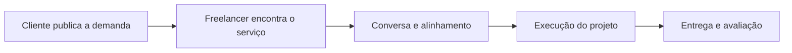
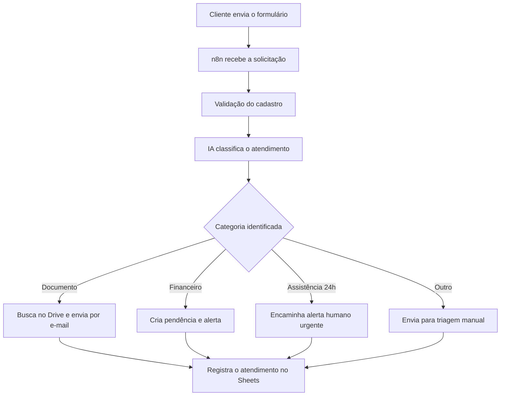

<div align="center">

### Olá! Eu sou o Nadav 👋

Estudante de **Engenharia de Software** e técnico em **Desenvolvimento de Sistemas**.<br>
Transformo ideias em soluções digitais com desenvolvimento web, automação, IA e dados.

[](https://www.google.com/maps/place/Curitiba,+PR/)
[](https://www.linkedin.com/in/nadav-arik-widerpelc-904407284/)
[](https://github.com/nadav-widerpelc)

</div>

---

## Sobre mim

- 🎓 Cursando **Engenharia de Software** na Universidade Positivo
- 💻 Técnico em **Desenvolvimento de Sistemas**
- 🤖 Interesse em **inteligência artificial, automação e integração de APIs**
- 🗄️ Aprimorando conhecimentos em **bancos de dados e SQL**
- 🎨 Experiência com **UI/UX e Figma**
- ⚙️ Experiência prática com **n8n e automação de processos**
- 🌱 Em constante evolução por meio de projetos acadêmicos e pessoais

## Tecnologias e ferramentas

### Desenvolvimento


### Banco de Dados


### Automação, IA e dados


### Ferramentas


---

## Projetos em destaque

| 💼 Trampei | 🤖 Agente de IA para Corretora de Seguros |
| --- | --- |
| Marketplace acadêmico criado para conectar clientes e freelancers em um ambiente organizado e intuitivo. | Automação de atendimento que classifica solicitações e direciona cada caso pelo fluxo adequado. |
| **Destaques:** autenticação, publicação e busca de serviços, perfis, chat, chamadas, avaliações, notificações e projetos salvos. | **Destaques:** n8n, OpenAI, Google Forms, Sheets, Drive, e-mail, logs e revisão humana em casos críticos. |
| **Atuação:** concepção do produto, UX/UI no Figma e desenvolvimento web. | **Atuação:** construção do fluxo no n8n, integração de API e testes da automação. |
| [Conhecer o Trampei ↓](#trampei) | [Conhecer o agente de IA ↓](#agente-de-ia-para-corretora-de-seguros) |

---

## Documentação dos projetos

### Trampei

> Marketplace acadêmico criado para aproximar clientes que precisam de serviços e freelancers que buscam novas oportunidades.

#### Objetivo do Trampei

O Trampei reúne as principais etapas de uma contratação em um só ambiente: descoberta de profissionais, publicação de demandas, comunicação, acompanhamento do projeto e avaliação da experiência.

#### Jornada principal



#### Principais funcionalidades

| Área | Funcionalidades |
| --- | --- |
| Acesso | Login e cadastro de usuários |
| Descoberta | Busca de serviços e navegação por categorias |
| Oportunidades | Publicação de serviços e demandas |
| Perfil | Perfil profissional do freelancer |
| Comunicação | Chat, chamadas e notificações |
| Confiança | Avaliações entre clientes e freelancers |
| Organização | Itens salvos e acompanhamento de projetos |

#### Minha atuação

- Concepção e organização da proposta do produto
- Definição das funcionalidades e jornadas dos usuários
- Prototipação e criação das interfaces no Figma
- Aplicação de conceitos de UX/UI
- Desenvolvimento web do projeto acadêmico

#### Competências aplicadas

`Figma` · `UX/UI Design` · `Prototipação` · `Desenvolvimento Web` · `Requisitos` · `Pensamento de Produto`

#### Aprendizados

- Transformação de um problema em uma solução digital
- Mapeamento das jornadas de clientes e freelancers
- Priorização das funcionalidades de um marketplace
- Criação de interfaces orientadas às tarefas do usuário
- Organização e documentação de requisitos

---

### Agente de IA para Corretora de Seguros

> Automação acadêmica criada com n8n, inteligência artificial e serviços do Google para agilizar a triagem de solicitações de uma corretora de seguros.

#### Objetivo da automação

O agente recebe uma solicitação, verifica o cadastro do cliente, utiliza IA para identificar o tipo de atendimento e direciona o pedido para a ação adequada. Casos urgentes, duvidosos ou sensíveis continuam sob supervisão humana.

#### Minha participação

- Construção e organização do workflow no **n8n**
- Integração com a **API de inteligência artificial**
- Configuração das regras de classificação e roteamento
- Testes das etapas e das diferentes rotas da automação
- Uso de saída JSON estruturada para aumentar a confiabilidade

#### Tecnologias utilizadas

`n8n` · `OpenAI / LLM` · `Google Forms` · `Google Sheets` · `Google Drive` · `Gmail / SMTP` · `APIs`

#### Arquitetura do fluxo



#### Categorias de atendimento

| Categoria | Exemplos | Ação executada |
| --- | --- | --- |
| `DOCUMENTO` | Apólice, carteirinha ou boleto | Localiza o arquivo no Drive e envia por e-mail |
| `FINANCEIRO` | Parcela, atraso ou pagamento | Registra uma pendência e alerta o corretor |
| `ASSISTENCIA_24H` | Emergência ou pedido de socorro | Prioriza o encaminhamento ao atendimento humano |
| `OUTRO` | Pedido fora das categorias anteriores | Registra e direciona para triagem manual |

#### Exemplo de resposta da IA

```json
{
  "categoria": "DOCUMENTO",
  "confianca": 0.95,
  "resumo": "Cliente solicita o envio da apólice."
}
```

A saída estruturada permite que o n8n leia a resposta de maneira previsível e encaminhe a solicitação para a rota correta.

#### Uso responsável da IA

- 🔐 **Privacidade:** acesso restrito aos dados armazenados nos serviços utilizados
- 👁️ **Transparência:** o cliente deve saber que recebeu uma resposta automatizada
- 🧑‍💻 **Supervisão humana:** casos críticos ou não identificados são encaminhados ao corretor
- 🛡️ **Segurança:** entradas do usuário são tratadas como dados, evitando mudanças indevidas nas instruções do agente
- 📋 **Rastreabilidade:** registros de atendimento permitem auditoria e análise de falhas

> Projeto desenvolvido como protótipo acadêmico. Uma utilização real exige adequação à LGPD, controle de acesso, consentimento e políticas de retenção de dados.

#### Resultados e aprendizados

- Integração de diferentes serviços em um único workflow
- Classificação automática de solicitações em categorias controladas
- Encaminhamento de casos críticos para atendimento humano
- Uso de JSON para respostas mais consistentes
- Registro de logs para acompanhamento e auditoria
- Aplicação de princípios de ética e privacidade desde a concepção

---

## Atualmente estudando

`Engenharia de Software` → `Desenvolvimento Web` → `Banco de Dados` → `APIs` → `IA e Automação` → `Boas práticas`


## Vamos conversar?

Estou aberto a aprender, colaborar em projetos e trocar experiências sobre tecnologia, automação e desenvolvimento de software.

<div align="center">

[](https://www.linkedin.com/in/nadav-arik-widerpelc-904407284/)

### Sempre aprendendo. Sempre construindo. 🚀

</div>


# 🚀 Trabalhos Recentes

Aqui estão alguns dos meus projetos e trabalhos desenvolvidos durante minha formação em Engenharia de Software.

## 🤖 Desafio Final — Agente de IA

Projeto desenvolvido utilizando automação, inteligência artificial e integração de ferramentas.

### 📄 Apresentação

[📑 Visualizar apresentação em PDF](./Desafio_Final_Agente_IA.pdf)

### 🎥 Demonstração

Dentro da apresentação estão disponíveis os vídeos explicando o funcionamento da automação.

---

## 🛠️ Tecnologias

- Python
- Inteligência Artificial
- LLM
- n8n
- Automação
- APIs
